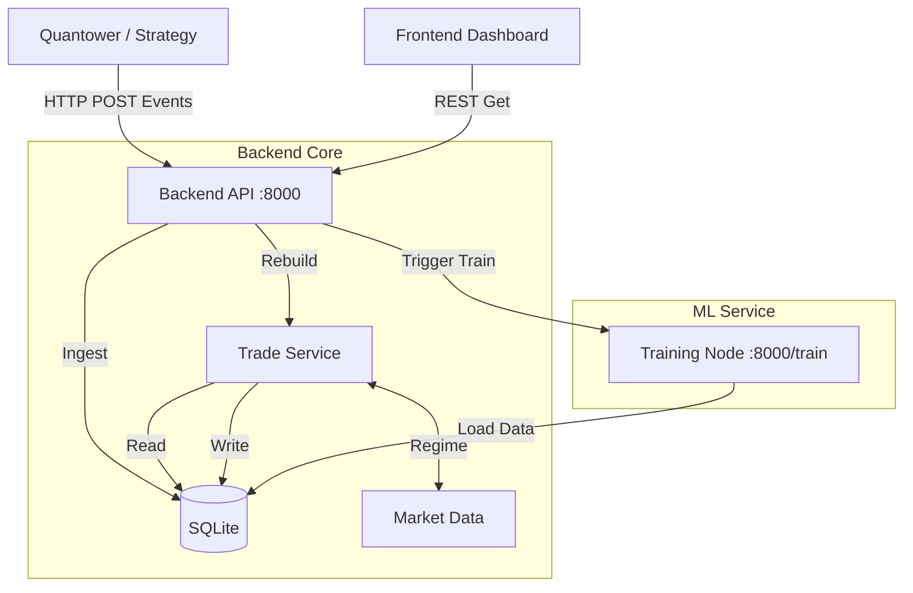

# Project Utilities Documentation

This document focuses on the core technical components of the Strategy Analysis Platform (Backend, Frontend, Auth, ML, Export), outlining their architecture, current status, and integration points.

---

## 1. Backend (FastAPI + SQLite)

**Location**: `backend/`  
**Entrypoint**: `run_server.py` → `src.api.main:app`

### Architecture
The backend is a **modular monolith** built on FastAPI, driven by an event ingestion pipeline.
*   **Database**: SQLite (`trading_data.db`) managed via SQLAlchemy ORM.
*   **Schema**:
    *   **Core**: `Strategy`, `StrategyInstance`, `StrategyRun`
    *   **Trading**: `Order`, `Execution`, `Trade` (Snapshot)
    *   **Market**: `MarketSeries`, `MarketBar` (Provider Data), `RunSeries`, `Bar` (Strategy Data)
*   **Key Services**:
    *   **Ingestion** (`src.api.routers.ingest`): High-throughput endpoint handling streamed events from exporters. Supports batching (`flush` logic implemented) to handle concurrent bursts.
    *   **Trade Reconstruction** (`src.core.trade_service`): Rebuilds trade lifecycles from raw `Execution` and `Order` events on-demand. **Recently updated** to include automatic Market Regime tagging.
    *   **Analytics** (`src.services.analytics`): Pluggable system calculating metrics (PnL, Sharpe, Drawdown) and storing them in `metrics_json`.

### Current State
*   ✅ **Ingestion**: Stable. Auto-flush logic prevents unique constraint errors during high-load batches.
*   ✅ **Trades**: "Live Stacked Imbalance" support verified. Regime detection logic integrated.
*   ✅ **Testing**: Pytest suite (`backend/tests`) covers integration flow and trade logic.

---

## 2. Authentication (OAuth2 + JWT)

**Location**: `backend/src/api/routers/auth.py`, `backend/src/auth/`

### Implementation
*   **Standard OAuth2 Password Flow**: `/api/auth/login` returns a Bearer JWT.
*   **User Model**: Stores hashed passwords (bcrypt) and Roles (`ADMIN`, `USER`).
*   **Protection**: Endpoints use `Depends(get_current_active_user)` to secure routes.
*   **Status**: Basic register/login/me flow is functional.

---

## 3. Frontend (React + Vite)

**Location**: `frontend/`

### Structure
*   **Routing**: Client-side routing via `react-router-dom`.
*   **State**: React Context (`SidebarContext`, `AuthContext`) + Hooks (`useStrategyData`).
*   **Visualization**:
    *   **Recharts**: Equity curves, PnL distributions.
    *   **Lightweight Charts**: Candlestick charts with trade markers (Work in progress for overlay).

### Key Pages
*   **Dashboard**: High-level KPIs, recent activity.
*   **Executions**: Raw table of fills with filtering.
*   **Trades**: Detailed trade analysis (Entry/Exit, MFE/MAE).
*   **Regime**: Market context visualization (Trend/Volatility).

### Current State
*   ✅ **UI**: Modern dark mode design.
*   ✅ **Data**: Fetches live from Backend REST API.
*   ⚠️ **Real-time**: Polling-based (potential upgrade to WebSockets in future).

---

## 4. Machine Learning (Training Node)

**Location**: `services/training_node/`

### Design
A standalone **Microservice** (FastAPI) allowing isolation of heavy TF/PyTorch workloads from the main API.
*   **Environment**: `EnvFlex` (Custom Gym-like environment for trading).
*   **Model**: `CustomDQNModel` (TensorFlow/Keras).
*   **Trainer**: `Trainer` class managing the RL loop (Reply Buffer, Target Network).

### Workflow
1.  **Request**: Main backend POSTs to `/train` with `run_id`, `model_architecture`, and data.
2.  **Job**: Training runs as a background task; status is pollable via `/status/{job_id}`.
3.  **Result**: Returns Model Artifacts / Logs.

### Current State
*   ✅ **Service Skeleton**: Functional FastAPI app with background workers.
*   ⚠️ **Integration**: Loosely coupled. Needs tighter integration with `StrategyRun` to auto-trigger training on completed runs.

---

## 5. Exporters (.NET 8)

**Location**: `exporters/`

### Components
*   **StrategyExporter**: Shared .NET library handling HTTP posting to `api/ingest`.
*   **Quantower Template**: A reference implementation showing how to hook into `OnUpdate` / `OnMessage` in Quantower to stream events.

### Workflow
*   **Push-based**: The trading platform (Quantower) pushes events (Orders, Fills, Bars) immediately to the Backend.
*   **Resilience**: Buffered export (local queue) ensures events aren't lost if the backend hiccups (to be verified in high-latency scenarios).

---

## Architecture Diagram (Conceptual)

