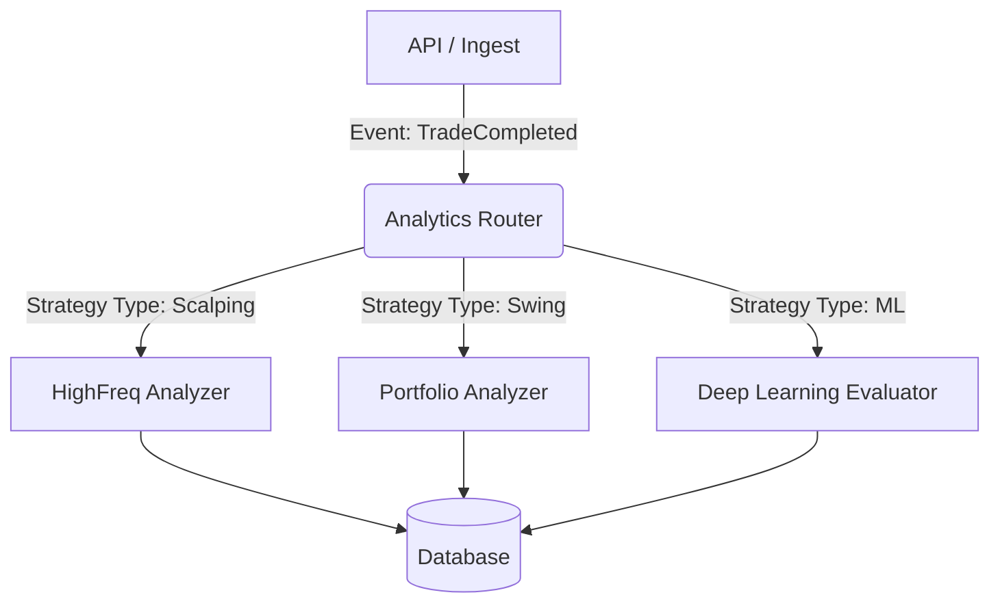

# Architecture Refactor Analysis: Analytics Service Extraction

## Objective
Extract `TradeAnalyzer` (currently in `src/core/analytics.py`) into a standalone service or modular component to support "Complex Routing" and advanced metrics without blocking the main API.

## Current State Limitations
1.  **Tight Coupling**: `TradeAnalyzer` directly accesses `src.database.models` and the same `Session` as the API.
2.  **Resource Contention**: Heavy calculations (e.g., rolling metrics, MAE/MFE over tick data) run in the same process as the API, potentially causing latency for UI requests.
3.  **Rigidity**: All strategies share the same analysis logic. It's hard to apply specific metrics (e.g., "Sortino" for Crypto, "Calmar" for Futures) conditionally.

## Proposed Architecture: "Analytics Router"

### Implications of Extraction

#### 1. Service Boundaries & Interface
-   **Old Way**: `analyzer = TradeAnalyzer(db); analyzer.calculate(run_id)`
-   **New Way**: The Analyzer becomes a background worker (or separate microservice).
    -   **Input**: `run_id`, `strategy_type`
    -   **Output**: Updates `metrics_json` in DB or creates new `AnalysisReport` records.
    -   **Communication**: Queue-based (RabbitMQ/Redis) or Async Task (Celery/BackgroundTasks).

#### 2. Data Access Patterns
-   The Analyzer Service needs efficient **Read Access** to `Execution`, `Order`, and `Bar` tables.
-   It might need a **Replica DB** connection to avoid locking the main transactional DB during heavy queries.

#### 3. "Complex Routing" Logic
-   The **Router** component decides *which* analyzer to trigger based on `Strategy.type` or `Strategy.tags`.
    -   *Example*: A "Market Maker" strategy needs fill-rate analysis (MFE is less relevant).
    -   *Example*: A "Trend Follower" strategy needs MAE and Drawdown duration analysis.
-   **Implementation**: A `ServiceFactory` or `Strategy pattern` in the backend code that selects the implementation class based on config.

#### 4. Infrastructure Impact
-   **Docker**: Would require a separate container (`analytics-worker`) to scale independently.
-   **Dependencies**: The worker can have heavy libs (`scikit-learn`, `tensorflow`) without bloating the lightweight API container.

## Immediate Action Plan (Refactoring Steps)
1.  **Define Interface**: Create an abstract `IAnalyticsService` interface.
2.  **Implement Standard Analyzer**: Wrap existing `TradeAnalyzer` logic into `StandardAnalyticsService`.
3.  **Implement Router**: Create a dispatcher in `trade_service.py` that selects the service based on `run.strategy.type`.
4.  **Async Execution**: Move the `calculate` call to a proper Background Task (as started in `ingest.py`).

## Risk Assessment
-   **Complexity**: Increases system surface area. Overkill if there's only 1 strategy type.
-   **Latency**: Metrics won't be "instant" (eventual consistency). UI must handle "Analysis Pending" state.
